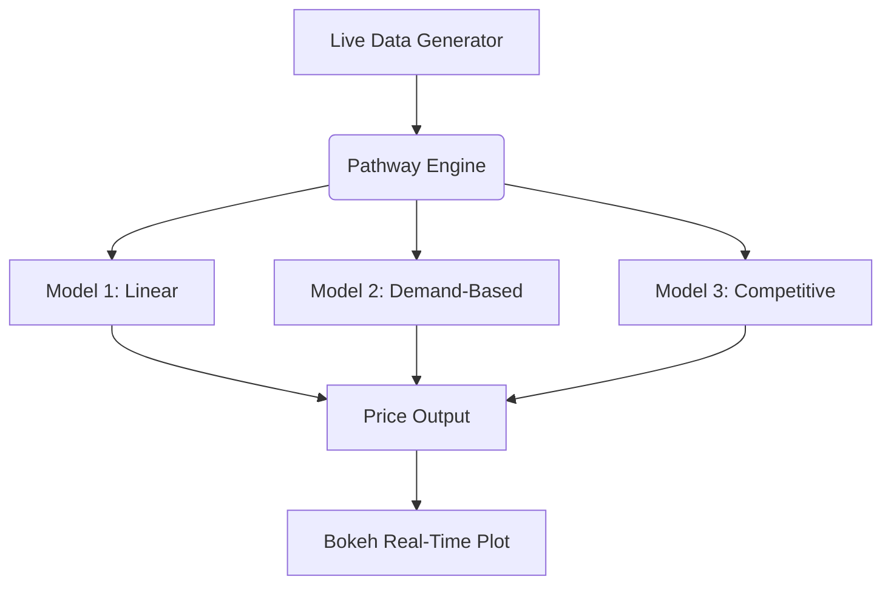

#  Urban Parking Dynamic Pricing

This repository contains the final submission for the **Summer Analytics 2025 Capstone Project**, hosted by the **Consulting & Analytics Club × Pathway**.

We built an intelligent real-time pricing engine for 14 urban parking spaces using **Pathway**, **Bokeh**, and custom logic for 3 pricing models, each increasing in complexity. The system simulates real-world demand and adapts parking prices based on vehicle traffic, occupancy, queue length, competition, and more.

---

##  Tech Stack

- **Python** (Jupyter / Colab)
- **Pandas**, **NumPy**
- **Pathway** – real-time streaming engine
- **Bokeh** – for real-time interactive visualizations
- **Mermaid** – for architecture diagram (optional)

---

##  Architecture Diagram



---

##  Project Workflow

1. **Data Ingestion:** Real-time data streamed via a replay generator or infinite generator (Pathway PythonReader).
2. **Model Computation:**
   - **Model 1:** Linear increase with occupancy
   - **Model 2:** Price varies based on normalized demand
   - **Model 3:** Adds competitor pricing & rerouting logic
3. **Price Output:** All prices are updated and visualized in real-time.
4. **Visualization:** Bokeh renders a live graph of all three models for each parking lot.

---

##  Repository Structure

```
urban-parking-dynamic-pricing/
├── Final_Sample_Notebook_With_Models_and_Visualization.ipynb
├── assets/
│   └── architecture_diagram.png
├── requirements.txt
└── README.md
```

---

##  Key Features

- Real-time pricing simulation with live Bokeh graphs
- Modular, interpretable pricing logic
- All 3 models implemented from scratch (no external ML libraries)
- Visual output suitable for final presentations or reports

---

##  Notes

- All prices are clamped between 5 and 20 for realism.
- Project tested and executed in Google Colab.
- Includes demand normalization, vehicle type weights, and real-world constraints.

---

##  Submission Info

- **Program:** Summer Analytics 2025
- **Host:** CnA Club × Pathway
- **Author:** Ankush Sharesth
- **Email:** a_sharesth@es.iitr.ac.in
- **GitHub:** [https://github.com/sharesth](https://github.com/sharesth)

---

##  How to Run

1. Open the `.ipynb` file in Google Colab.
2. Run all cells from top to bottom.
3. Optionally run `real_time_pricing_models.py` locally with:

```bash
bokeh serve --show real_time_pricing_models.py
```

---

##  Contact

For any queries or support, feel free to raise an issue or contact me via email.

---
